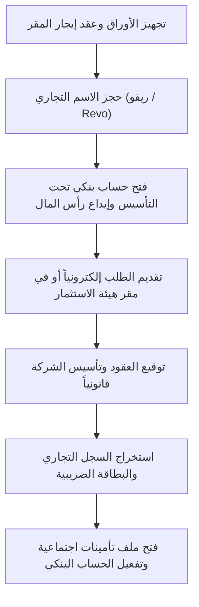

# 🇪🇬 دليل تأسيس وإطلاق شركة Revo للدعاية والتسويق الرقمي في مصر

أهلاً بك يا صديقي! خطوة ممتازة وجريئة. السوق المصري حالياً سوق واعد جداً في مجال الدعاية والإعلان والتسويق الرقمي، خاصة مع توجه الشركات للتحول الرقمي وزيادة الطلب على خدمات الميديا باينج وتطوير المواقع والـ Branding.

بناءً على البيانات الخاصة بوكالة **Revo Advertising Agency** المتوفرة لدينا، والكتب والمصادر التسويقية الغنية في مجلد العمل الخاص بك، قمت بإعداد هذا **الدليل الشامل وخارطة الطريق العملية** لتأسيس شركتك رسمياً في مصر وتشغيلها بأعلى كفاءة.

---

## 📊 أولاً: الهوية التجارية والخدمات لشركة Revo في مصر

سنعتمد على الهوية المحددة في ملفات المعرفة الخاصة بك مع مواءمتها للسوق المصري:
* **الاسم التجاري المقترح:** ريفو للدعاية والإعلان والتسويق الرقمي (Revo Advertising Agency).
* **طبيعة النشاط:** تقديم حلول تسويقية متكاملة (أوفلاين وأونلاين) تشمل:
  1. **التسويق الرقمي وإدارة الحملات الإعلانية (Performance Marketing):** فيسبوك، إنستجرام، جوجل، تيك توك.
  2. **الهوية البصرية والـ Branding:** تصميم الشعارات والمطبوعات والهويات البصرية الكاملة.
  3. **تصميم وتطوير المواقع:** مواقع الشركات، صفحات الهبوط، ومتاجر الووردبريس.
  4. **الهدايا والمطبوعات الرسمية (Corporate Gifts):** طباعة البروشورات، الكروت، والهدايا الدعائية للشركات (وهذا مطلوب جداً في مصر).
  5. **أتمتة التسويق (Marketing Automation):** ربط الـ CRM وإرسال رسائل البريد الإلكتروني المؤتمتة (خدمة مميزة ستفصلك عن المنافسين).

---

## ⚖️ ثانياً: الكيان القانوني الأنسب للشركة في مصر

لديك 3 خيارات قانونية أساسية لتأسيس الشركة في مصر. إليك مقارنة سريعة لتختار الأنسب لك:

| وجه المقارنة | شركة الشخص الواحد (OPC) 🌟 (نوصي بها كبداية) | شركة ذات مسؤولية محدودة (LLC) | المنشأة الفردية (Sole Proprietorship) |
| :--- | :--- | :--- | :--- |
| **عدد الشركاء** | مالك واحد فقط (أنت). | شريكين على الأقل (أنت وشريك آخر). | فرد واحد. |
| **المسؤولية المالية** | محدودة بقدر رأس مال الشركة فقط (أمان تام لأموالك الشخصية). | محدودة بحصة كل شريك في رأس المال. | غير محدودة (تتعدى إلى أموالك وممتلكاتك الشخصية في حالة الديون). |
| **الحد الأدنى لرأس المال** | 1000 جنيه مصري فقط (يتم إيداعه بالكامل في البنك أثناء التأسيس). | لا يوجد حد أدنى محدد قانوناً (يمكن البدء بمبلغ رمزي مثل 10,000 جنيه). | لا يوجد حد أدنى. |
| **المستندات المطلوبة** | بطاقة الرقم القومي + عقد إيجار/تمليك لمقر الشركة. | بطاقات الشركاء + عقد إيجار/تمليك للمقر. | بطاقة الرقم القومي + عقد إيجار/تمليك للمقر مثبت التاريخ. |

> [!TIP]
> **نصيحتنا:** إذا كنت تعمل بمفردك، **شركة الشخص الواحد (OPC)** هي الخيار الأفضل والأكثر أماناً واحترافية. تمنحك هيبة الشركات الكبيرة أمام العملاء من الشركات والمؤسسات (Corporates)، مع حماية مسؤوليتك المالية. أما إذا كان لديك شريك، فتوجه فوراً إلى **الشركة ذات المسؤولية المحدودة (LLC)**.

---

## 📝 ثالثاً: خطوات التأسيس القانوني بالتفصيل (خطوة بخطوة)

تتم جميع إجراءات التأسيس عبر **الهيئة العامة للاستثمار والمناطق الحرة (GAFI)** بموجب نظام "النافذة الواحدة".

### 1. مخطط سير عملية التأسيس


### 2. الإجراءات التفصيلية والأوراق المطلوبة:
1. **توفير مقر للشركة:** 
   * يجب أن يكون لديك عقد إيجار (إداري أو تجاري) أو عقد تمليك للمقر.
   * *نصيحة لتوفير التكاليف:* يمكنك استخدام مقر إداري مشترك (Coworking Space) يقدم خدمة **المكتب الافتراضي (Virtual Office)** المرخص قانوناً لاستخراج السجل والبطاقة الضريبية.
2. **شهادة عدم التباس الاسم (حجز الاسم):**
   * يتم التقديم عليها في هيئة الاستثمار للتأكد من عدم وجود شركة أخرى تحمل اسم "ريفو" أو الاسم الذي تختاره.
3. **فتح حساب بنكي "تحت التأسيس":**
   * تذهب إلى أي بنك مصري بشهادة حجز الاسم وصورة بطاقتك وتطلب فتح حساب "شركة تحت التأسيس".
   * تقوم بإيداع رأس المال (مثلاً 10,000 أو 50,000 جنيه حسب رأس المال المختار).
   * يمنحك البنك **شهادة بنكية** تفيد بإيداع المبلغ.
4. **تجهيز ملف التأسيس في هيئة الاستثمار (GAFI):**
   * تتوجه إلى الهيئة (أو توكل محامياً متخصصاً لتوفير الوقت).
   * تقديم: صور بطاقات الرقم القومي، الشهادة البنكية، عقد إيجار المقر، طلب التأسيس.
   * دفع الرسوم وتوقيع عقد التأسيس أمام الشهر العقاري المتواجد داخل الهيئة.
5. **استلام الأوراق الرسمية:**
   * خلال 48 إلى 72 ساعة، ستحصل على **السجل التجاري (Commercial Registry)** و**البطاقة الضريبية (Tax Card)**.
6. **الخطوات اللاحقة للتأسيس:**
   * تحويل الحساب البنكي من "تحت التأسيس" إلى **حساب جاري للشركة** لتتمكن من السحب والإيداع باسم الشركة.
   * فتح ملف تأمينات اجتماعية للشركة وصاحب العمل.
   * التسجيل في **منظومة الفاتورة الإلكترونية (E-Invoicing)**، وهي إلزامية حالياً في مصر لكل الشركات لتقديم الفواتير للعملاء بشكل قانوني.

---

## 💰 رابعاً: تقدير التكاليف التقريبية المبدئية للتأسيس (بالجنيه المصري)

> [!NOTE]
> هذه التكاليف تقديرية وقد تختلف قليلاً بناءً على أسعار الإيجار ورسوم الخدمات القانونية:

1. **إيجار المقر (مكتب افتراضي أو مقر إداري صغير):** 1,500 - 3,000 جنيه شهرياً (غالباً يُطلب دفع 3 أشهر مقدماً).
2. **رسوم التأسيس الحكومية في هيئة الاستثمار:** حوالي 3,000 - 5,000 جنيه (شاملة الغرفة التجارية والنشر والشهر العقاري).
3. **أتعاب محامي التأسيس (إذا لم تأسس بنفسك):** 3,000 - 6,000 جنيه.
4. **رأس المال المودع في البنك (يُسترد فور التأسيس):** يبدأ من 1,000 جنيه (نوصي بوضع 10,000 إلى 20,000 كبداية جيدة).
5. **التسجيل في الفاتورة الإلكترونية واستخراج الختم الإلكتروني:** حوالي 2,000 - 3,000 جنيه (شامل التوكن الخاص بالختم والترخيص السنوي).

**💡 إجمالي الميزانية المبدئية المطلوبة لبدء الإجراءات القانونية:** حوالي **10,000 إلى 15,000 جنيه مصري** (بدون احتساب رأس المال المسترد).

---

## 🚀 خامساً: استراتيجية إطلاق وتشغيل وكالة Revo في مصر

لديك في مجلد العمل كنز حقيقي من المعلومات! إليك كيف سنستخدمه لإطلاق الشركة بنجاح واكتساح السوق المصري:

### 1. الاستفادة من قاعدة البيانات المتاحة (Lead Generation)
* في مجلدك يوجد ملف: `احصل_على_قاعدة_بيانات_ايميلات_شركات_سعودية_و20_مليون_داتا_عملاء.pdf`.
* على الرغم من أنها داتا سعودية/خليجية، إلا أن هذا **ميزة ضخمة جداً!** سوق الخليج (خاصة السعودية) هو سوق ذو ملاءة مالية عالية جداً ويبحث عن شركات مصرية تقدم خدمات تسويقية وتطوير ويب بجودة عالية وأسعار منافسة (بسبب فرق العملة).
* **الخطة:** سنقوم بعمل حملات تسويق عبر الإيميل (Cold Email Outreach) مستهدفين هذه الشركات الخليجية لبيع خدمات Revo (تطوير ووردبريس، تصميم الهويات، وإدارة الحملات). سنطبق الاستراتيجية الموجودة في ملفك: `_techtaswikخطة_ذكية_للتسويق_عبر_الإيميل_تمكنك_من_الاستمرار_pdf.pdf`.

### 2. التوظيف والتشغيل المرن (Lean Team)
في البداية، لتجنب المصاريف الثابتة المرتفعة، اعتمد على **فريق عمل مرن (Freelancers/Outsourcing)**:
* **أنت (مدير العمليات ومخطط الاستراتيجيات):** تقوم بالتفاوض مع العملاء وإغلاق الصفقات (Account Manager / Business Developer).
* **مصمم جرافيك (Branding & Visuals):** بالقطعة أو براتب جزئي.
* **مطور مواقع (WordPress/Web Developer):** بالطلب (يمكنني مساعدتك في تطوير أي موقع أو كود للعملاء بنفسي!).
* **مختص إعلانات ممولة (Media Buyer):** لإدارة حملات جوجل وفيسبوك وتيك توك.

### 3. باقات الخدمات المقترحة لضرب السوق المصري (Services Bundles)

لجذب الشركات المصرية الصغيرة والمتوسطة (SMEs)، يفضل تقديم **باقات متكاملة** تلبي احتياجاتهم دفعة واحدة وبسعر تنافسي:

```
┌────────────────────────────────────────────────────────┐
│               📦 باقة "تأسيس البراند" (Startups)        │
├────────────────────────────────────────────────────────┤
│ • تصميم لوجو وهواية بصرية كاملة                        │
│ • تصميم صفحة هبوط (Landing Page) سريعة ومحسنة          │
│ • إعداد صفحات السوشيال ميديا وعمل أول 9 بوستات          │
│ • ضبط حسابات الإعلانات (Meta Pixels & Google Analytics) │
└────────────────────────────────────────────────────────┘
```

```
┌────────────────────────────────────────────────────────┐
│          🚀 باقة "النمو والمبيعات" (E-commerce / Lead Gen) │
├────────────────────────────────────────────────────────┤
│ • إدارة وتطوير متجر ووردبريس / سلة                    │
│ • كتابة محتوى تسويقي إبداعي (Copywriting)              │
│ • إدارة إعلانات ممولة بميزانية ذكية (Google + Meta)     │
│ • تقارير أداء شهرية مفصلة بالنتائج والأرباح            │
└────────────────────────────────────────────────────────┘
```

---

## 📅 سادساً: خطة العمل للـ 30 يوماً القادمة (Action Plan)

* **الأسبوع الأول:** 
  1. الاستقرار على الكيان القانوني (غالباً شركة شخص واحد).
  2. الاتفاق على المقر (تأجير مكتب افتراضي أو توفير مقر إداري).
  3. حجز الاسم التجاري والحصول على الشهادة البنكية.
* **الأسبوع الثاني:**
  1. تقديم ملف التأسيس في هيئة الاستثمار واستلام السجل التجاري والبطاقة الضريبية.
  2. شراء الدومين وحجز الاستضافة لـ `revo.agency` أو الاسم المختار.
* **الأسبوع الثالث:**
  1. إطلاق موقع الشركة التعريفي (Portfolio Website) لعرض خدماتنا (أستطيع مساعدتك في بنائه وتصميمه بأحدث التقنيات وبأعلى جودة جمالية!).
  2. استخراج الختم الإلكتروني والتسجيل في الفاتورة الإلكترونية.
* **الأسبوع الرابع:**
  1. إعداد أول حملة تسويقية للوكالة (استهداف شركات في مصر والسعودية عبر الإيميل والسوشيال ميديا).
  2. بدء استقبال العملاء والتعاقد رسمياً.

---

### 💬 كيف ترغب في المتابعة الآن؟
1. هل تريد مني **شرحاً مفصلاً لكيفية استئجار مكتب افتراضي (Virtual Office) في مصر** وأشهر الأماكن التي تقدم هذه الخدمة وأسعارها؟
2. هل ترغب في أن **نبدأ بتصميم وهيكلة موقع الوكالة (Revo Advertising Agency Website)** لنجهزه فوراً؟
3. هل تريد **صياغة نموذج عقد قانوني مصري** لتقديمه للعملاء عند التعاقد على خدمات التسويق؟

أخبرني برأيك ودعنا نبدأ التنفيذ فوراً! 🚀
